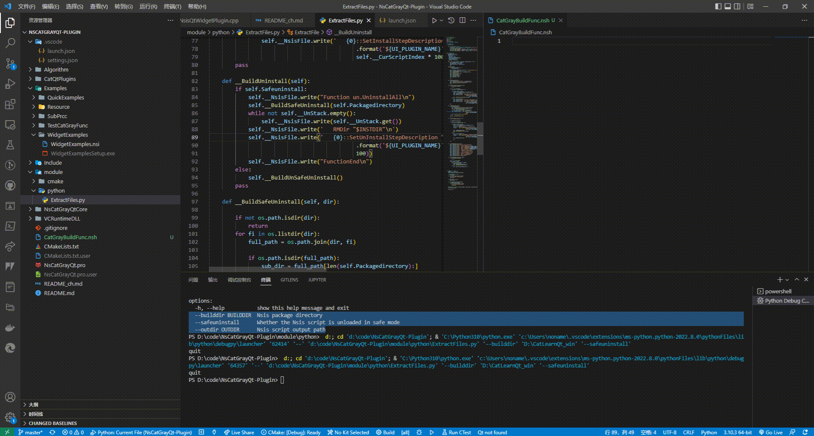

[>>> 中文](README_ch.md)

# Introduction

Provides a way to create a beautiful, modern Windows platform installation interface.  

Based on Nsis+Qt complete, provide QWidgets,Quick implementation cases. 

**NsCatGrayQt-Plugin structure**


[Reference Item](https://github.com/winsoft666/NSIS-UI-Plugin)
Innovation and improvement on the shoulders of giants!

---

**NSIS**

Individual from [https://nsis.sourceforge.io/Download](https://nsis.sourceforge.io/Download)  Download and install NSIS, add the system environment variable 'NSIS_DIR' to the NSIS installation directory. 

**Qt**

Because plug-ins use Qt as the interface library by default, you need to install Qt.  

The Qt installation package will add the 'QTDIR' environment variable to the installation directory by default. If it is not added automatically, you need to add it manually. 

---

# Get Started

**Directory description**

```txt
CatQtPlugins    -- Quick, QWidget code example
VCRuntimeDLL    -- Place VC++ runtime library files (Debug and Release), Qt interface library is compiled in MD mode by default, runtime needs to rely on VC++ runtime library 
Include         -- Custom Nsis header files
module          -- Provide cmake module, NSIS installation function to generate scripts
NsCatGrayQtCore -- C++ and nsis interaction low-level implementation
Examples        -- Nsis script package cases
```

**Compile**

Compilation support CMake, Qmake, can directly compile nSCATgrayqt-plugin directory CMake and Qmake project.  DLL ', 'qtQuickPlugin.dll' Release: 'qtwidgetplugin.dll', 'qtQuickplugin.dll') 


**Use python scripts to generate nSIS install and uninstall functions**

```txt
// module/python/ExtractFiles.py
ExtractFiles.py [-h] [--builddir BUILDDIR] [--safeuninstall] [--outdir OUTDIR]
ExtractFiles.py' '--builddir' './' '--safeuninstall'

  --builddir BUILDDIR  Nsis package directory
  --safeuninstall      Whether the Nsis script is unloaded in safe mode
  --outdir OUTDIR      Nsis script output path
```

Using the ExtractFiles script will generate the CatGrayBuildFunc. NSH module (install and uninstall functions) 



# Demonstration

