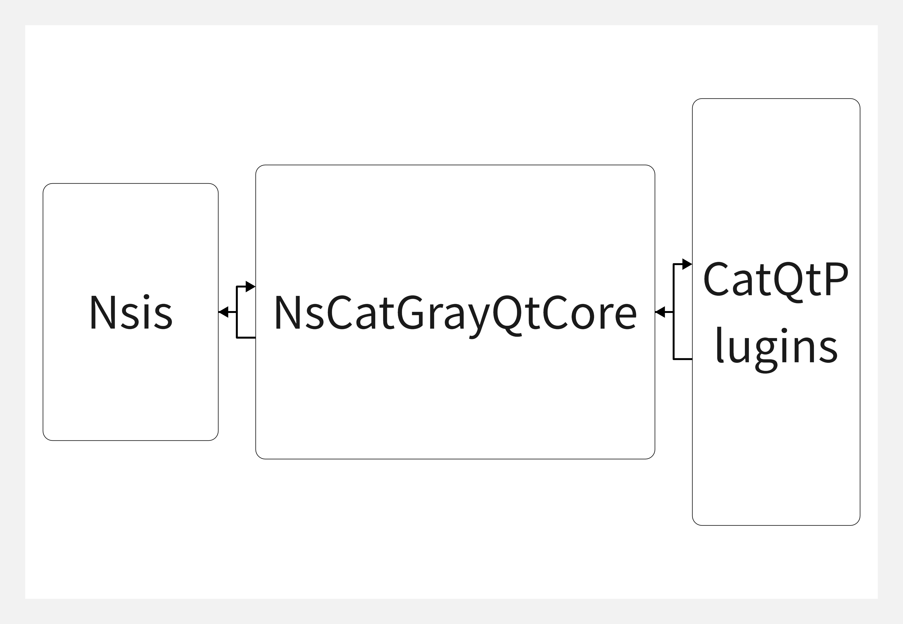
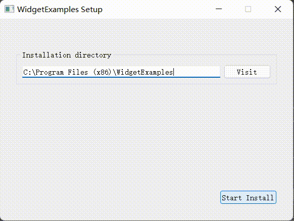

[>>> English Version](README.md)

# 介绍
提供一种创建漂亮地、现代化地Windows平台安装界面的方式。
基于Nsis+Qt完成,提供QWidgets,Quick实现案例。

**NsCatGrayQt-Plugin结构图**



[参考项目](https://github.com/winsoft666/NSIS-UI-Plugin)
站在巨人的肩上创新改进!

---

**NSIS**

从[https://nsis.sourceforge.io/Download](https://nsis.sourceforge.io/Download) 下载NSIS并安装,新增系统环境变量`NSIS_DIR`为NSIS安装目录。

**Qt**

因为插件默认使用Qt作为界面库，所以需要安装Qt。
Qt安装包会默认将安装目录添加`QTDIR`环境变量，如果没有自动添加，则需要手动添加。

---

# 开始使用

**目录描述**

```txt
CatQtPlugins    -- 提供了Quick，QWidget代码案例
VCRuntimeDLL    -- 放置VC++运行时库文件（Debug版和Release版），Qt界面库默认采用MD模式编译，运行时需要依赖VC++运行时库
Include         -- 自定义Nsis头文件
module          -- 提供cmake模块，nsis安装函数生成脚本
NsCatGrayQtCore -- C++与nsis交互底层实现
```

**编译**

编译支持CMake，Qmake，可直接编译NsCatGrayQt-Plugin目录下的cmake与qmake工程。编译成功后会生成（Debug版：`QtWidgetPlugind.dll`,`QtQuickPlugind.dll` Release版：`QtWidgetPlugin.dll`,`QtQuickPlugin.dll`）


# 演示

